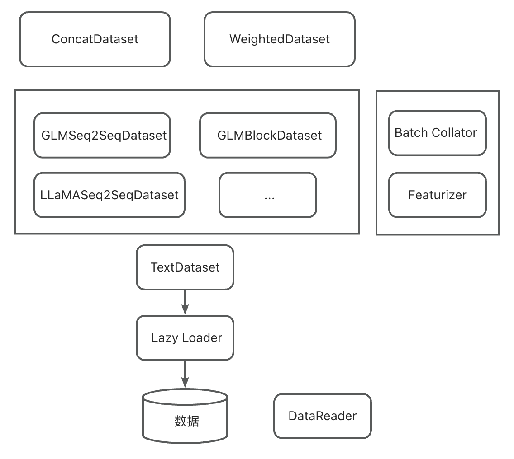

# AntLLM统一Dataset模块
AntLLM库提供了统一的Dataset模块，为不同的任务提供统一的数据读取范式和特征提取接口。


## 核心概念
### TextDataset
参考Megatron中的设计，Dataset分成底层数据集和上层数据集，底层数据集负责IO相关，关注点为如何高效的解决大数据量的访问；上层数据集负责封装特定任务的逻辑。AntLLM中的底层Dataset为TextDataset，它内部提供数据读取、Tokenize、数据分片等功能。数据读取支持直接读取和使用Memory Map的方式进行大文件读取（Lazy Loader），并完成了对现有预训练和SFT阶段的数据读取方式的兼容。TextDataset中的每个Item都是一个Dict，有较好的扩展性。下游任务如果有特殊的数据处理和采样方式，可继承TextDataset做进一步处理；否则可直接使用TextDataset搭配场景内的Batch Collator实现训练数据构造。

### Featurizer/Batch Collator
Featurizer用于对单个数据sample的特征提取，单独抽象出来一方面是为了提升特征提取模块的复用，另一方面是为了Featurizer可以保证training和inference阶段特征提取逻辑的统一维护。

Batch Collator用于对Batch-level的特征提取，大多数情况下，Batch Collator会调用Featurizer进行Batch内Sample的逐个特征提取。有的多任务场景，会在Batch Collator内按照一定的概率调用不同的Featurizer。

### Multi Dataset
当训练数据来自多个不同的数据源时，我们需要将这些数据源组合成一个新的Dataset并对上层保持透明。AntLLM中提供了多种数据集融合的方式。

- ConcatDataset
ConcatDataset会将多个Dataset拼接起来，上层使用时跟使用单个Dataset体验一致，Dataset内数据Sample的顺序也不会变化。

- BlendableDataset
参考Megatron-LM中的BlendableDataset实现，支持给数据集设置权重，结合数据集权重和该数据集中的Sample数共同决定实际采样的Sample数。

- WeightedDataset
与BlendableDataset类似，差别在于WeightedDataset会先按照权重去采样一个数据集，然后再从这个数据集中选择一条数据Sample。

- SplitDataset
通过传入一个index列表，来获得一个Dataset的子集。


## 示例

### 预训练

旧版Dataset模块需要将待训练的数据集注册到`corpora.py`文件内，相对较为麻烦，并且不利于配置化管理。使用新版Dataset进行与预训练的流程如下：

- 依然可使用与旧版Dataset相同的数据预处理逻辑，将数据预先做好tokenize和分片
- 编写一个配置文件，用于管理多个训练数据集，示例如下：
```yaml
type: WeightedDataset
args:
  datasets:
    -
      type: GLMBlockDataset
      args:
        name: d1
        data_path: PATH_TO_DATA
        need_tokenize: false
        lazy_loader_opt: v1
        scatter_num: 1
        load_old_format: true
    -
      type: GLMBlockDataset
      args:
        name: d2
        data_path: PATH_TO_DATA
        need_tokenize: false
        lazy_loader_opt: v1
        scatter_num: 1
        load_old_format: true
  weights: [1, 1]
```
其中：
  - `type`：指所用的Dataset类型名
  - `args`：指该Dataset所需要的参数，需要注意的是，参数中如果需要tokenizer，不需要在配置文件中指定，默认会传入。参数中如果还有其他dataset，可以用上述嵌套的方式配置。可以看到，上面创建了一个WeightedDataset，它里面包含了两个子Dataset，并且二者权重都是1。

在内部的子Dataset里，我们使用了GLM预训练所需的`GLMBlockDataset`，`need_tokenize`设置为`false`，因为我们已经预处理过了；`lazy_loader_opt`设置为`v1`代表使用旧版LazyLoader来处理数据，`scatter_num`设置为1代表分片数为`1`，`load_old_format`是为了兼容旧版预处理的产物，因为我们使用了旧版数据预处理流程，这里需要把这个参数置为`true`

- 编写完配置文件后，原先训练参数里，使用`--datasetv2`说明要使用新版Dataset处理逻辑，`--train-data`传入上述配置文件路径即可。


### SFT

SFT部分改动较小，基本与现有体验一致，仅需在训练参数里添加`--datasetv2`即可使用新版Dataset。代码侧的改动如下：
```python
if data_args.datasetv2:
    train_dataset = GLMSeq2SeqDataset(name="train",
                                        data_path=train_data_path,
                                        tokenizer=tokenizer,
                                        max_length=data_args.max_length,
                                        max_input_length=data_args.max_input_length,
                                        max_output_length=data_args.max_output_length,
                                        left_truncate=data_args.left_truncate,
                                        scatter_num=world_size)
    test_dataset = GLMSeq2SeqDataset(name="test",
                                        data_path=test_data_path,
                                        tokenizer=tokenizer,
                                        max_length=data_args.max_length,
                                        max_input_length=data_args.max_input_length,
                                        max_output_length=data_args.max_output_length,
                                        left_truncate=data_args.left_truncate,
                                        scatter_num=1)
```
