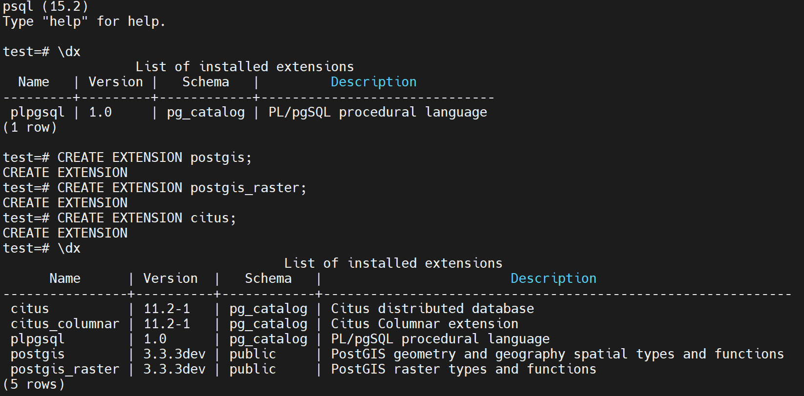

# Run PostgreSQL on Occlum

[`PostgreSQL`](https://www.postgresql.org/) is a powerful, open source object-relational database system that uses and extends the SQL language combined with many features that safely store and scale the most complicated data workloads.

Besides, PostgreSQL has powerful add-ons such as the popular [`PostGIS`](https://postgis.net/) geospatial database extender and [`Citus`](https://www.citusdata.com/) for distributed tables.

This demo demonstrates how to run a Postgres server in Occlum with extension PostGIS and Citus installed.

## Build Requirements

Assumping users do all the build on Occlum Ubuntu 20.04 based development docker image, such as "occlum/occlum:0.29.4-ubuntu20.04".

```
apt update
apt install -y flex libgeos-dev libgdal-dev liblz4-dev python3-dev libzstd-dev lld libopenblas-dev
```

## PostgreSQL modifications for Occlum

To support PostgreSQL running successfully in Occlum, some minor changes are required.

### Use vfork for starting subprocesses

PostgreSQL starts subprocesses by fork in default. But Occlum doesn't support **fork** method by design. To make PG runs in Occlum, macro **EXEC_BACKEND** needs to be defined and replace `fork+exec` by `vfork`.

### Do not check root

PostgreSQL forbids root user to run in default. But in Occlum LibOS, there is only root user.

### Undefine some macros to fit for Occlum

Occlum doesn't implement all syscalls. So some syscalls could be replaced/ignored by undefining some macros in `pg_config_manual.h`.

All above changes could be found on the [patch](./0001-Make-pg15-running-on-Occlum.patch).

## Create and Download Python Packages

PG supports define python functions. To use python function, the required python and packages should get prepared first. Occlum recommends using **Conda** for this purpose. Details please check script [`install_python_with_conda.sh`](./install_python_with_conda.sh). Users could customize the packages in the script.

In our case, just run the script for the preparation.
```
./install_python_with_conda.sh
```

## Build and install

Just run the script [`build_pg.sh`](./build_pg.sh). If everything goes well, it builds and installs PostgreSQL 15.2, and extensions PostGIS, Citus in the host `/usr/local/pgsql`.
```
./build_pg.sh
```

## Build the Occlum Instance

Just run the script [`build_occlum_instance.sh`](./build_occlum_instance.sh).

Please note, two PG configuration files are provided as example, [`postgresql.conf`](./postgresql.conf) and [`pg_hba.conf`](./pg_hba.conf). Users can do customization themselves. Just remember re-run the `build_occlum_instance.sh` after the customization.

## External PG Data Mount

To make PG data could be preserved and reused even the Occlum PG instance got upgraded or rebuilt, the PG data needs to be saved in the external mount data point. Here are the steps how this could be done.

1. Create empty external mount point.
2. Add mount info into the Occlum.json
3. Do **initdb** once after Occlum PG server started.
4. Start the Occlum PG server by specifying PG data path and configuration files path.

Steps **1** and **2** are done in the script [build_occlum_instance.sh](./build_occlum_instance.sh). In short word, the **../pg_data** in the host side is mounted into the Occlum instance as path **/pg_data** which will be used as the PG server data path.

Steps **3** and **4** are described in next chapter.

## How to Start

Now users can start the Occlum instance.
```
cd occlum_instance
occlum start
```

### Initialize the Data Base

This is the step **3**. It should be done just once.
```
occlum exec /usr/local/pgsql/bin/initdb -D /pg_data
```

### Start the PG Server

```
occlum exec /usr/local/pgsql/bin/pg_ctl -D /pg_data -l /host/logfile -o '--config-file=/etc/pgconf/postgresql.conf' -o '--hba-file=/etc/pgconf/pg_hba.conf' start
```

It starts the PG server, specify the data path **/pg_data** and also the configuration files, maps the PG log to host side. Users can find the logfile in the `occlum_instance` directory.

Then, users can create a `test` DB for following tests by using PG binaries installed in the host per `localhost`.
```
/usr/local/pgsql/bin/createdb test -h localhost
```

Now, users can do a simple benchmark.
```
/usr/local/pgsql/bin/pgbench -i -h localhost test
/usr/local/pgsql/bin/pgbench -h localhost -c 10 -t 1000 test
```

## Create PG Extensions

Also, users can access the PG server by psql shell like below.
```
/usr/local/pgsql/bin/psql test -h localhost
```

In our case, extensions PostGIS and Citus are already in the Occlum image file system, thus users can install these extensions.



After extensions installed, users can try spatial query or distributed scaling just as the general PG ways.

## Stop the PG Server

```
occlum exec /usr/local/pgsql/bin/pg_ctl -D /pg_data -l /host/logfile -o '--config-file=/etc/pgconf/postgresql.conf' -o '--hba-file=/etc/pgconf/pg_hba.conf' stop
occlum stop
```

There maybe error output in first command.
